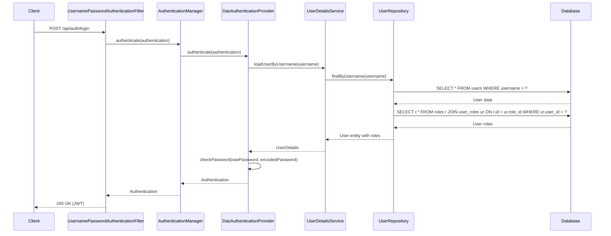
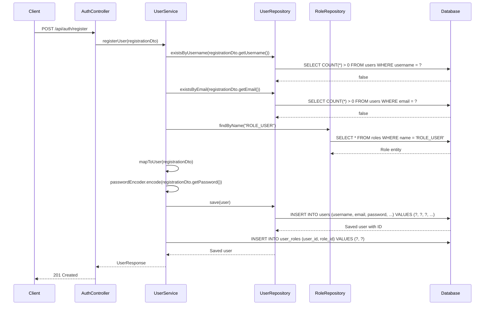

# Database Interaction in Spring Security JWT Authentication

This document provides a detailed explanation of how the application interacts with the database during authentication and authorization processes.

## Table of Contents
1. [Database Schema](#database-schema)
2. [Authentication Flow with Database](#authentication-flow-with-database)
3. [UserDetailsService Implementation](#userdetailsservice-implementation)
4. [Entity Definitions](#entity-definitions)
5. [Repository Layer](#repository-layer)
6. [Transaction Management](#transaction-management)
7. [Performance Considerations](#performance-considerations)
8. [Testing Database Interactions](#testing-database-interactions)

## Database Schema

### Users Table
```sql
CREATE TABLE users (
    id BIGINT PRIMARY KEY AUTO_INCREMENT,
    username VARCHAR(50) NOT NULL UNIQUE,
    email VARCHAR(100) NOT NULL UNIQUE,
    password VARCHAR(100) NOT NULL,
    enabled BOOLEAN NOT NULL DEFAULT true,
    account_non_expired BOOLEAN NOT NULL DEFAULT true,
    account_non_locked BOOLEAN NOT NULL DEFAULT true,
    credentials_non_expired BOOLEAN NOT NULL DEFAULT true,
    created_at TIMESTAMP DEFAULT CURRENT_TIMESTAMP,
    updated_at TIMESTAMP DEFAULT CURRENT_TIMESTAMP ON UPDATE CURRENT_TIMESTAMP
);
```

### Roles Table
```sql
CREATE TABLE roles (
    id BIGINT PRIMARY KEY AUTO_INCREMENT,
    name VARCHAR(50) NOT NULL UNIQUE,
    description VARCHAR(255)
);
```

### User Roles Join Table
```sql
CREATE TABLE user_roles (
    user_id BIGINT NOT NULL,
    role_id BIGINT NOT NULL,
    PRIMARY KEY (user_id, role_id),
    FOREIGN KEY (user_id) REFERENCES users(id) ON DELETE CASCADE,
    FOREIGN KEY (role_id) REFERENCES roles(id) ON DELETE CASCADE
);
```

## Authentication Flow with Database

### 1. Login Request


### 2. User Registration


## UserDetailsService Implementation

### UserDetailsServiceImpl.java
```java
@Service
@RequiredArgsConstructor
public class UserDetailsServiceImpl implements UserDetailsService {
    
    private final UserRepository userRepository;
    
    @Override
    @Transactional(readOnly = true)
    public UserDetails loadUserByUsername(String username) throws UsernameNotFoundException {
        // This triggers a database query
        User user = userRepository.findByUsername(username)
            .orElseThrow(() -> new UsernameNotFoundException(
                "User not found with username: " + username));
        
        // This triggers a second query to load roles (if not using JOIN FETCH)
        return org.springframework.security.core.userdetails.User.builder()
            .username(user.getUsername())
            .password(user.getPassword())
            .disabled(!user.isEnabled())
            .accountExpired(!user.isAccountNonExpired())
            .accountLocked(!user.isAccountNonLocked())
            .credentialsExpired(!user.isCredentialsNonExpired())
            .authorities(user.getAuthorities())
            .build();
    }
}
```

### Optimized with JOIN FETCH
```java
@Repository
public interface UserRepository extends JpaRepository<User, Long> {
    
    @Query("SELECT DISTINCT u FROM User u " +
           "LEFT JOIN FETCH u.roles " +
           "WHERE u.username = :username")
    Optional<User> findByUsername(@Param("username") String username);
}
```

## Entity Definitions

### User Entity
```java
@Entity
@Table(name = "users")
@Getter @Setter
@NoArgsConstructor
@AllArgsConstructor
@Builder
public class User implements UserDetails, Serializable {
    
    @Id
    @GeneratedValue(strategy = GenerationType.IDENTITY)
    private Long id;
    
    @Column(nullable = false, unique = true)
    private String username;
    
    @Column(nullable = false, unique = true)
    private String email;
    
    @Column(nullable = false)
    private String password;
    
    private boolean enabled = true;
    private boolean accountNonExpired = true;
    private boolean accountNonLocked = true;
    private boolean credentialsNonExpired = true;
    
    @ManyToMany(fetch = FetchType.LAZY)
    @JoinTable(
        name = "user_roles",
        joinColumns = @JoinColumn(name = "user_id"),
        inverseJoinColumns = @JoinColumn(name = "role_id")
    )
    private Set<Role> roles = new HashSet<>();
    
    @Override
    public Collection<? extends GrantedAuthority> getAuthorities() {
        return roles.stream()
            .map(role -> new SimpleGrantedAuthority(role.getName()))
            .collect(Collectors.toList());
    }
    
    // Other UserDetails methods...
}
```

### Role Entity
```java
@Entity
@Table(name = "roles")
@Getter @Setter
@NoArgsConstructor
@AllArgsConstructor
@Builder
public class Role {
    
    @Id
    @GeneratedValue(strategy = GenerationType.IDENTITY)
    private Long id;
    
    @Column(nullable = false, unique = true)
    private String name;
    
    private String description;
    
    @ManyToMany(mappedBy = "roles", fetch = FetchType.LAZY)
    private Set<User> users = new HashSet<>();
}
```

## Repository Layer

### UserRepository.java
```java
@Repository
public interface UserRepository extends JpaRepository<User, Long> {
    
    // Basic query method
    Optional<User> findByUsername(String username);
    
    // Check if username exists
    boolean existsByUsername(String username);
    
    // Check if email exists
    boolean existsByEmail(String email);
    
    // Find users by enabled status
    List<User> findByEnabled(boolean enabled);
    
    // Custom query with JOIN FETCH for performance
    @Query("SELECT DISTINCT u FROM User u " +
           "LEFT JOIN FETCH u.roles " +
           "WHERE u.username = :username")
    Optional<User> findByUsernameWithRoles(@Param("username") String username);
    
    // Update last login time
    @Modifying
    @Query("UPDATE User u SET u.lastLogin = CURRENT_TIMESTAMP WHERE u.username = :username")
    void updateLastLogin(@Param("username") String username);
}
```

## Transaction Management

### Service Layer with Transactions
```java
@Service
@RequiredArgsConstructor
public class UserService {
    
    private final UserRepository userRepository;
    private final RoleRepository roleRepository;
    private final PasswordEncoder passwordEncoder;
    
    @Transactional
    public UserResponse registerUser(RegistrationRequest request) {
        // Check if username exists
        if (userRepository.existsByUsername(request.getUsername())) {
            throw new UsernameAlreadyExistsException("Username is already taken");
        }
        
        // Check if email exists
        if (userRepository.existsByEmail(request.getEmail())) {
            throw new EmailAlreadyExistsException("Email is already in use");
        }
        
        // Create new user
        User user = new User();
        user.setUsername(request.getUsername());
        user.setEmail(request.getEmail());
        user.setPassword(passwordEncoder.encode(request.getPassword()));
        
        // Assign default role
        Role userRole = roleRepository.findByName("ROLE_USER")
            .orElseThrow(() -> new RuntimeException("Default role not found"));
        user.getRoles().add(userRole);
        
        // Save user (cascades to user_roles)
        User savedUser = userRepository.save(user);
        
        return mapToUserResponse(savedUser);
    }
    
    @Transactional(readOnly = true)
    public UserResponse getUserProfile(String username) {
        User user = userRepository.findByUsername(username)
            .orElseThrow(() -> new UsernameNotFoundException("User not found"));
        return mapToUserResponse(user);
    }
    
    // Other service methods...
}
```

## Performance Considerations

### 1. N+1 Problem
**Problem**: Loading a user and their roles results in multiple queries.

**Solution**: Use `JOIN FETCH` in your repository methods:
```java
@Query("SELECT DISTINCT u FROM User u " +
       "LEFT JOIN FETCH u.roles " +
       "WHERE u.username = :username")
Optional<User> findByUsernameWithRoles(@Param("username") String username);
```

### 2. Second-Level Caching
Enable Hibernate second-level cache for frequently accessed data:

1. Add dependencies:
```xml
<dependency>
    <groupId>org.hibernate.orm</groupId>
    <artifactId>hibernate-jcache</artifactId>
</dependency>
<dependency>
    <groupId>org.ehcache</groupId>
    <artifactId>ehcache</artifactId>
</dependency>
```

2. Configure in `application.properties`:
```properties
spring.jpa.properties.hibernate.cache.use_second_level_cache=true
spring.jpa.properties.hibernate.cache.region.factory_class=jcache
spring.jpa.properties.javax.persistence.sharedCache.mode=ENABLE_SELECTIVE
```

3. Annotate entities:
```java
@Entity
@Cacheable
@org.hibernate.annotations.Cache(usage = CacheConcurrencyStrategy.READ_WRITE)
public class User implements UserDetails {
    // ...
}
```

## Testing Database Interactions

### Integration Test Example
```java
@SpringBootTest
@AutoConfigureTestDatabase
@Transactional
class UserServiceIntegrationTest {
    
    @Autowired
    private UserService userService;
    
    @Autowired
    private UserRepository userRepository;
    
    @Test
    void whenRegisterUser_thenUserIsSaved() {
        // Given
        RegistrationRequest request = new RegistrationRequest();
        request.setUsername("testuser");
        request.setEmail("test@example.com");
        request.setPassword("password123");
        
        // When
        UserResponse response = userService.registerUser(request);
        
        // Then
        assertThat(response.getUsername()).isEqualTo("testuser");
        assertThat(userRepository.existsByUsername("testuser")).isTrue();
    }
    
    @Test
    void whenLoginWithValidCredentials_thenReturnUser() {
        // Given
        String username = "existinguser";
        String password = "password123";
        
        // When/Then
        assertThatNoException().isThrownBy(() -> 
            authenticationManager.authenticate(
                new UsernamePasswordAuthenticationToken(username, password)
            )
        );
    }
}
```

### Test Containers for Integration Tests
```java
@Testcontainers
@SpringBootTest
@AutoConfigureMockMvc
class AuthControllerIntegrationTest {
    
    @Container
    private static final PostgreSQLContainer<?> postgres = 
        new PostgreSQLContainer<>("postgres:13");
    
    @DynamicPropertySource
    static void configureProperties(DynamicPropertyRegistry registry) {
        registry.add("spring.datasource.url", postgres::getJdbcUrl);
        registry.add("spring.datasource.username", postgres::getUsername);
        registry.add("spring.datasource.password", postgres::getPassword);
    }
    
    @Test
    void whenRegisterUser_thenCanLogin() throws Exception {
        // Test registration and login flow
    }
}
```

This document provides a comprehensive guide to understanding and working with database interactions in the Spring Security JWT authentication system.
