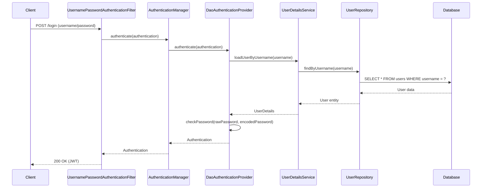

# Spring Security Database Authentication Flow

This document explains how Spring Security interacts with the database during the authentication process.

## Login Flow with Database Interaction

### 1. Login Request
```http
POST /api/auth/login
Content-Type: application/json

{
    "username": "testuser",
    "password": "password123"
}
```

### 2. Spring Security Filter Chain
- `UsernamePasswordAuthenticationFilter` intercepts the request
- Extracts username and password from the request
- Creates an `Authentication` object (unauthenticated)

### 3. AuthenticationManager
- Receives the authentication request
- Delegates to the appropriate `AuthenticationProvider` (usually `DaoAuthenticationProvider`)

## The Database Interaction Point

### UserDetailsService Implementation
```java
@Service
public class UserDetailsServiceImpl implements UserDetailsService {
    
    private final UserRepository userRepository;
    
    @Override
    @Transactional(readOnly = true)
    public UserDetails loadUserByUsername(String username) {
        // Database query happens here
        User user = userRepository.findByUsername(username)
            .orElseThrow(() -> new UsernameNotFoundException(
                "User not found with username: " + username));
                
        // Convert to Spring Security's UserDetails
        return new org.springframework.security.core.userdetails.User(
            user.getUsername(),
            user.getPassword(),
            user.getAuthorities()
        );
    }
}
```

## What Happens During Login

### 1. Database Query
- The `findByUsername()` method executes a SQL query:
  ```sql
  SELECT * FROM users WHERE username = ?
  ```
- This is a `@Transactional(readOnly = true)` operation

### 2. User Not Found
- If no user is found, it throws `UsernameNotFoundException`
- Results in a 401 Unauthorized response

### 3. User Found
- User's details (including hashed password) are loaded
- The `UserDetails` object is created and returned

### 4. Password Verification
- `DaoAuthenticationProvider` takes the password from the login request
- Uses the configured `PasswordEncoder` (BCrypt) to check if it matches the stored hash
- If passwords don't match, throws `BadCredentialsException` (401)

### 5. On Successful Authentication
- Creates a fully populated `Authentication` object
- Stores it in the `SecurityContext`
- Proceeds with generating the JWT token

## Complete Flow in Code

### Login Controller
```java
@PostMapping("/login")
public ResponseEntity<JwtResponse> login(@RequestBody LoginRequest request) {
    // This triggers the authentication process
    Authentication authentication = authenticationManager.authenticate(
        new UsernamePasswordAuthenticationToken(
            request.getUsername(), 
            request.getPassword()
        )
    );
    
    // Only reached if authentication is successful
    String jwt = jwtService.generateToken(authentication);
    return ResponseEntity.ok(new JwtResponse(jwt));
}
```

### Sequence Diagram


## Key Points to Remember

### 1. Lazy Loading
- The user is loaded from the database only when `loadUserByUsername()` is called

### 2. Password Handling
- The raw password never leaves the server
- Only the hashed version is stored and compared

### 3. Transaction Management
- `@Transactional(readOnly = true)` ensures efficient database connection usage
- The transaction is committed after the authentication process

### 4. Caching
- Consider adding `@Cacheable` to `loadUserByUsername` for better performance
- Invalidate the cache on password changes

### 5. Error Handling
- `UsernameNotFoundException`: Missing users
- `BadCredentialsException`: Wrong passwords
- `AccountStatusException`: Locked/disabled accounts

## Security Considerations

1. **SQL Injection Prevention**
   - Always use parameterized queries (handled automatically by Spring Data JPA)
   - Never concatenate user input directly into SQL queries

2. **Password Storage**
   - Always use strong hashing (BCrypt, Argon2, PBKDF2)
   - Never store plain-text passwords
   - Use appropriate work factor for password hashing

3. **Session Management**
   - Use stateless authentication with JWT
   - Implement proper token expiration and refresh token mechanism

4. **Rate Limiting**
   - Implement rate limiting on login endpoints
   - Consider account lockout after failed attempts

5. **Audit Logging**
   - Log authentication attempts (success/failure)
   - Monitor for suspicious login patterns
