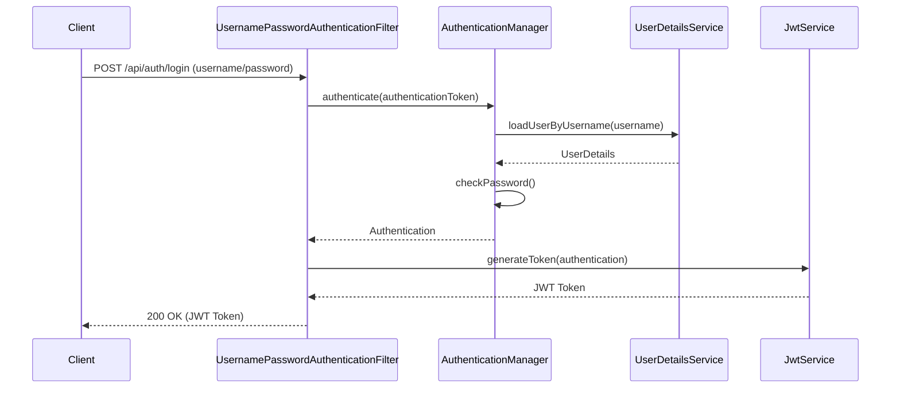

# Spring Security JWT Authentication - Lecture Notes

## Table of Contents
1. [Introduction to JWT Authentication](#introduction-to-jwt-authentication)
2. [Project Setup and Dependencies](#project-setup-and-dependencies)
3. [Understanding the Authentication Flow](#understanding-the-authentication-flow)
4. [Deep Dive into Security Configuration](#deep-dive-into-security-configuration)
5. [Implementing UserDetailsService](#implementing-userdetailsservice)
6. [JWT Token Generation and Validation](#jwt-token-generation-and-validation)
7. [Protecting API Endpoints](#protecting-api-endpoints)
8. [Testing the Application](#testing-the-application)
9. [Security Best Practices](#security-best-practices)
10. [Common Pitfalls and Solutions](#common-pitfalls-and-solutions)

## Introduction to JWT Authentication

### What is JWT?
JSON Web Tokens (JWT) are an open standard (RFC 7519) that defines a compact and self-contained way for securely transmitting information between parties as a JSON object.

### Why Use JWT?
- **Stateless**: No need to store session information on the server
- **Scalable**: Works well in distributed systems
- **Secure**: Digitally signed to ensure data integrity
- **Flexible**: Can contain any type of data

### JWT Structure
A JWT consists of three parts:
1. **Header**: Contains token type and hashing algorithm
2. **Payload**: Contains the claims (statements about the user)
3. **Signature**: Used to verify the token wasn't changed

## Project Setup and Dependencies

### Required Dependencies
```xml
<dependencies>
    <!-- Spring Boot Starters -->
    <dependency>
        <groupId>org.springframework.boot</groupId>
        <artifactId>spring-boot-starter-security</artifactId>
    </dependency>
    <dependency>
        <groupId>org.springframework.boot</groupId>
        <artifactId>spring-boot-starter-web</artifactId>
    </dependency>
    
    <!-- JWT Support -->
    <dependency>
        <groupId>org.springframework.security</groupId>
        <artifactId>spring-security-oauth2-resource-server</artifactId>
    </dependency>
    <dependency>
        <groupId>org.springframework.security</groupId>
        <artifactId>spring-security-oauth2-jose</artifactId>
    </dependency>
    
    <!-- Database -->
    <dependency>
        <groupId>org.springframework.boot</groupId>
        <artifactId>spring-boot-starter-data-jpa</artifactId>
    </dependency>
    <dependency>
        <groupId>com.h2database</groupId>
        <artifactId>h2</artifactId>
        <scope>runtime</scope>
    </dependency>
</dependencies>
```

## Understanding the Authentication Flow

### 1. Registration Flow


### 2. Login Flow


### 3. Protected Resource Access


## Deep Dive into Security Configuration

### SecurityConfig.java
```java
@Configuration
@EnableWebSecurity
@EnableMethodSecurity
@RequiredArgsConstructor
public class SecurityConfig {
    
    private final UserDetailsService userDetailsService;
    
    @Bean
    public SecurityFilterChain securityFilterChain(HttpSecurity http) throws Exception {
        return http
            .csrf(AbstractHttpConfigurer::disable)
            .authorizeHttpRequests(auth -> auth
                .requestMatchers("/api/auth/**").permitAll()
                .anyRequest().authenticated()
            )
            .oauth2ResourceServer(oauth2 -> oauth2
                .jwt(jwt -> jwt.decoder(jwtDecoder()))
            )
            .sessionManagement(session -> 
                session.sessionCreationPolicy(SessionCreationPolicy.STATELESS)
            )
            .userDetailsService(userDetailsService)
            .build();
    }
    
    @Bean
    public PasswordEncoder passwordEncoder() {
        return new BCryptPasswordEncoder();
    }
    
    @Bean
    public JwtDecoder jwtDecoder() {
        return NimbusJwtDecoder.withPublicKey(publicKey).build();
    }
    
    @Bean
    public AuthenticationManager authenticationManager(
            AuthenticationConfiguration authConfig) throws Exception {
        return authConfig.getAuthenticationManager();
    }
}
```

## Implementing UserDetailsService

### UserDetailsServiceImpl.java
```java
@Service
@RequiredArgsConstructor
public class UserDetailsServiceImpl implements UserDetailsService {
    
    private final UserRepository userRepository;
    
    @Override
    @Transactional(readOnly = true)
    public UserDetails loadUserByUsername(String username) {
        User user = userRepository.findByUsername(username)
            .orElseThrow(() -> new UsernameNotFoundException(
                "User not found with username: " + username));
                
        return User.builder()
            .username(user.getUsername())
            .password(user.getPassword())
            .authorities(user.getRoles().stream()
                .map(role -> new SimpleGrantedAuthority(role.getName()))
                .collect(Collectors.toList()))
            .build();
    }
}
```

## JWT Token Generation and Validation

### JwtService.java
```java
@Service
@RequiredArgsConstructor
public class JwtService {
    
    private final JwtEncoder jwtEncoder;
    private final JwtDecoder jwtDecoder;
    
    public String generateToken(Authentication authentication) {
        Instant now = Instant.now();
        
        String scope = authentication.getAuthorities().stream()
            .map(GrantedAuthority::getAuthority)
            .collect(Collectors.joining(" "));
            
        JwtClaimsSet claims = JwtClaimsSet.builder()
            .issuer("self")
            .issuedAt(now)
            .expiresAt(now.plus(1, ChronoUnit.HOURS))
            .subject(authentication.getName())
            .claim("scope", scope)
            .build();
            
        return this.jwtEncoder.encode(
            JwtEncoderParameters.from(claims)).getTokenValue();
    }
    
    public boolean validateToken(String token) {
        try {
            Jwt jwt = jwtDecoder.decode(token);
            return !jwt.getExpiresAt().isBefore(Instant.now());
        } catch (Exception e) {
            return false;
        }
    }
}
```

## Protecting API Endpoints

### Controller Example
```java
@RestController
@RequestMapping("/api/secure")
public class SecureController {
    
    @GetMapping("/me")
    public ResponseEntity<UserProfile> getCurrentUser(
            @AuthenticationPrincipal Jwt jwt) {
        String username = jwt.getSubject();
        // Fetch user details and return
        return ResponseEntity.ok(userProfile);
    }
    
    @PreAuthorize("hasRole('ADMIN')")
    @GetMapping("/admin")
    public ResponseEntity<String> adminOnly() {
        return ResponseEntity.ok("Admin area");
    }
}
```

## Testing the Application

### Registration Test
```http
POST http://localhost:8080/api/auth/register
Content-Type: application/json

{
    "username": "testuser",
    "email": "test@example.com",
    "password": "Password123!"
}
```

### Login Test
```http
POST http://localhost:8080/api/auth/login
Content-Type: application/json

{
    "username": "testuser",
    "password": "Password123!"
}
```

### Accessing Protected Resource
```http
GET http://localhost:8080/api/secure/me
Authorization: Bearer <your-jwt-token>
```

## Security Best Practices

1. **Password Security**
   - Always use strong password hashing (BCrypt, Argon2, PBKDF2)
   - Enforce password policies (length, complexity)
   - Implement account lockout after failed attempts

2. **JWT Security**
   - Use strong signing algorithms (RS256, ES256)
   - Set appropriate token expiration (15min-1h for access tokens)
   - Implement refresh tokens for longer sessions
   - Store tokens securely (HTTP-only cookies for web)

3. **HTTPS**
   - Always use HTTPS in production
   - Enable HSTS header
   - Use secure and HttpOnly flags for cookies

4. **Input Validation**
   - Validate all user inputs
   - Use parameterized queries to prevent SQL injection
   - Sanitize output to prevent XSS

## Common Pitfalls and Solutions

### 1. Token Theft
**Problem**: If a JWT is stolen, it can be used until expiration.
**Solution**: 
- Use short-lived access tokens (15-30 minutes)
- Implement refresh tokens with stricter security
- Use token binding (binding token to client fingerprint)

### 2. Insecure Token Storage
**Problem**: Storing tokens in localStorage is vulnerable to XSS attacks.
**Solution**:
- Use HTTP-only cookies for web applications
- For mobile apps, use secure storage solutions

### 3. Lack of Token Revocation
**Problem**: Cannot invalidate tokens before they expire.
**Solution**:
- Maintain a token blacklist
- Use token versioning in the database
- Keep token lifetime short

### 4. Insufficient Logging
**Problem**: Hard to detect and investigate security incidents.
**Solution**:
- Log all authentication attempts (success/failure)
- Log token generation and validation
- Implement proper log rotation and monitoring

## Conclusion

In this lecture, we've covered:
1. The fundamentals of JWT authentication
2. Setting up a secure Spring Boot application
3. Implementing user registration and login
4. Protecting API endpoints
5. Security best practices

Remember that security is an ongoing process. Always stay updated with the latest security advisories and keep your dependencies up to date.

## Additional Resources
- [Spring Security Reference](https://docs.spring.io/spring-security/reference/)
- [JWT.io](https://jwt.io/)
- [OWASP Authentication Cheat Sheet](https://cheatsheetseries.owasp.org/cheatsheets/Authentication_Cheat_Sheet.html)
